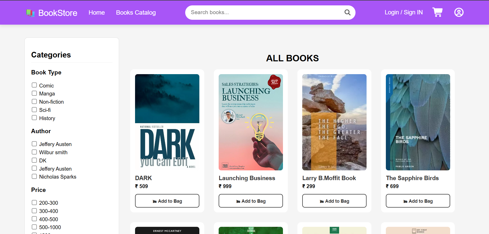
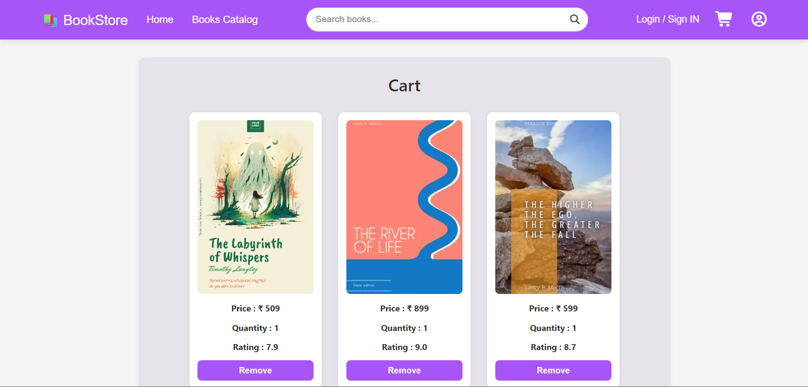
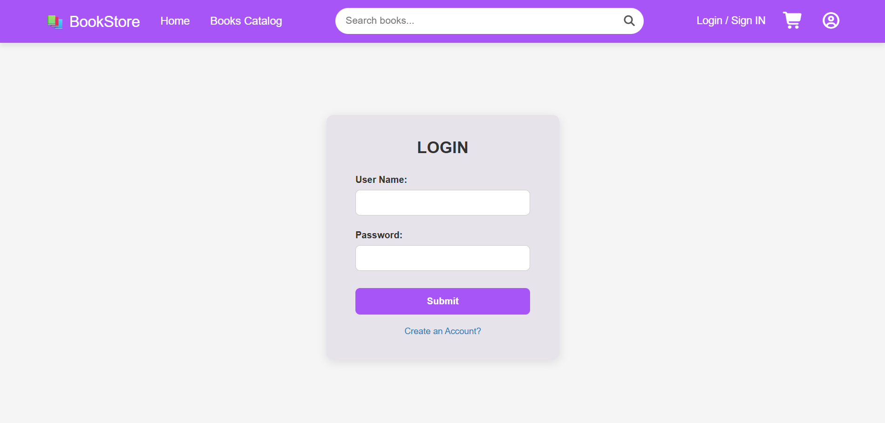
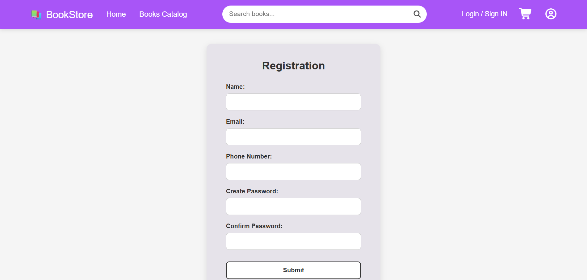

# 📚 BookStore-Invincible

**BookStore-Invincible** is a multi-page frontend web application that replicates the structure and user interface of a modern online bookstore.  
It provides a complete UI experience including homepage browsing, book catalog display, shopping cart management, user authentication screens, profile viewing, and a checkout/payment interface.

The project focuses on building a structured, visually clean, and user-friendly e-commerce layout using pure HTML and CSS without any backend or frameworks. It demonstrates practical implementation of layout systems, responsive design principles, reusable components, and multi-page navigation.

This project was built as part of frontend development practice to strengthen understanding of real-world website architecture and deployment using GitHub Pages.

---

## 🚀 Live Demo

🔗 https://rahifkhan22.github.io/BookStore-Invincible/

---

## ✨ Features

- 🏠 Homepage with hero section
- 📖 Books catalog page
- 🛒 Shopping cart page
- 🔐 Login & Sign-Up pages
- 👤 User profile page
- 💳 Payment / checkout page
- 🎨 Clean and modern UI
- 📱 Responsive layout structure

---

## 🛠 Technologies Used

- HTML5  
- CSS3  
- Font Awesome  
- Git & GitHub  
- GitHub Pages (Deployment)

---

## 📂 Project Structure

```
BookStore-Invincible/
│
├── index.html
├── catalog.html
├── cart.html
├── login.html
├── Sign-in.html
├── myprofile.html
├── payment.html
├── style.css
└── assets (images)
```
### 🖥️ Desktop Interface
| 🏠 Home Page | 📖 Books Catalog |
| :---: | :---: |
|  |  |

| 👤 User Profile | 🛒 Shopping Cart |
| :---: | :---: |
|  |  |

| 🔐 Login Page | 📝 Registration Page |
| :---: | :---: |
|  |  |
---

## 🎯 Purpose of the Project

This project was created to practice:

- Multi-page website development
- Layout design using Flexbox
- UI/UX structuring
- Git & GitHub workflow
- Deployment using GitHub Pages

---

## 👨‍💻 Author

**Rahif Khan**  
GitHub: https://github.com/rahifkhan22
